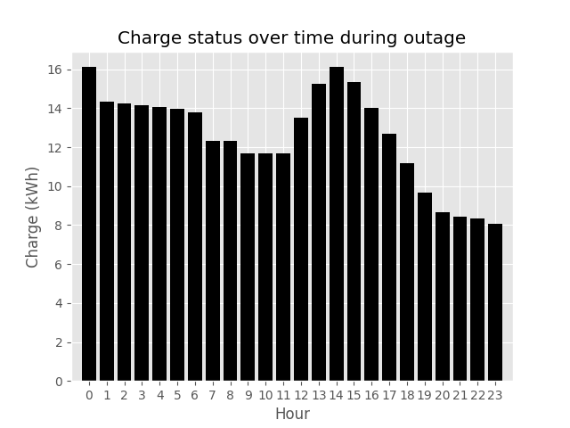
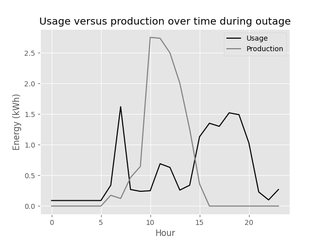

# BaSCOT: Battery and Solar Capacity Optimization Tool

##### Date: 15 February 2022

##### Alton Caylor

##### email: caylora@allegheny.edu

---


BaSCOT is an optimization tool that uses the OR-Tools library to solve linear optimization problems, determining the optimal capacity of solar panels and battery storage to maximize savings and improving energy resiliency in the face of grid outages.

## Installing / Getting startedc

Ensure python 3.9 or greater is installed, then run the following commands to execute the program.

```cmd
pip install or-tools
pip install numpy
pip install matplotlib

python src/__main__.py
```

Sample output:

```sample
Scenario: max
Objective function value: $-481.05
Array Capacity: 4.542 kW
Cost of array: $13170.54
Battery Capacity: 51.508 kWh
Cost of batteries: $17770.41
Combined upfront cost (with tax credit): $27516.61
Energy cost offset: $27035.56

Scenario: min
Objective function value: $16736.28
Array Capacity: 4.542 kW
Cost of array: $13170.54
Battery Capacity: 1.603 kWh
Cost of batteries: $553.08
Combined upfront cost (with tax credit): $10299.28
Energy cost offset: $27035.56

Scenario: median
Objective function value: $11729.00
Array Capacity: 4.542 kW
Cost of array: $13170.54
Battery Capacity: 16.117 kWh
Cost of batteries: $5560.36
Combined upfront cost (with tax credit): $15306.56
Energy cost offset: $27035.56
```

Sample images:






## Features

TODO: Add description

## Background

## Links

* [Repository](https://github.com/caylora/BaSCOT)
* [OR-Tools by Google](https://developers.google.com/optimization)
* [SCIP](https://www.scipopt.org/)
