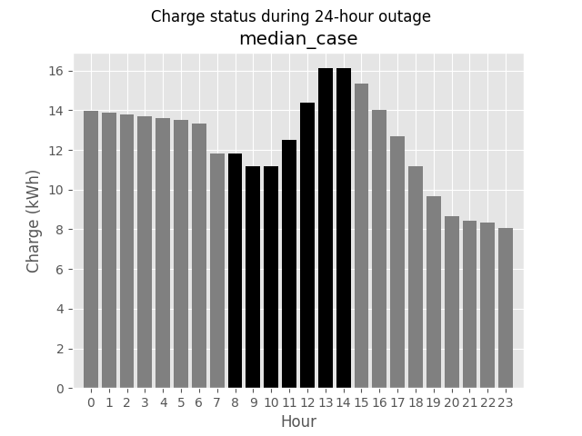
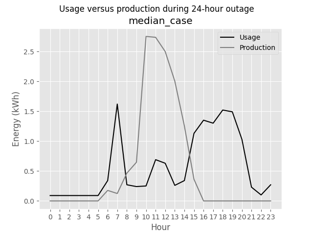
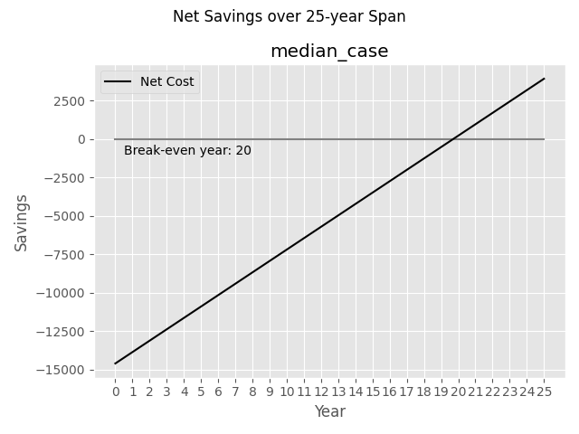

# BaSCOT: Battery and Solar Capacity Optimization Tool

##### Date: April 04, 2022

##### Alton Caylor

##### email: caylora@allegheny.edu

---


BaSCOT is an optimization tool that uses the OR-Tools library to solve mixed-integer linear optimization problems, determining the optimal capacity of solar panels and battery storage to maximize savings and improve energy resiliency in the face of grid outages.

## Installing / Getting started

Ensure python 3.9 or greater is installed, then run the following commands to execute the program.

```cmd
pip install or-tools
pip install numpy
pip install matplotlib

python src/__main__.py
```

Sample output:

```sample
Scenario: worst_case
Objective function value: $-8133.83
Array Capacity: 4.542 kW
Cost of array: $12307.64
Battery Capacity: 51.508 kWh
Cost of batteries: $17564.38
Combined upfront cost (with tax credit): $26672.03
Energy cost offset: $18538.20

Scenario: best_case
Objective function value: $8883.87
Array Capacity: 4.542 kW
Cost of array: $12307.64
Battery Capacity: 1.603 kWh
Cost of batteries: $546.67
Combined upfront cost (with tax credit): $9654.32
Energy cost offset: $18538.20

Scenario: median_case
Objective function value: $3934.65
Array Capacity: 4.542 kW
Cost of array: $12307.64
Battery Capacity: 16.117 kWh
Cost of batteries: $5495.89
Combined upfront cost (with tax credit): $14603.55
Energy cost offset: $18538.20
```

Sample images:








## Features

BaSCOT is designed to provide flexibility in the parameters of the scenarios it simulates. The data used in the objective function and constraints can be modified by the user, and changed according to the desired specifications for the individual site. For example, the available area for solar panels is highly dependent on the type of installation and space available at each site, and could often have a direct impact on the amount of solar panels that are appropriate to install. Every piece of data used by the program can be modified to suit the needs of the site and the user. Modifying the amount of years to project into the future or the number of hours during the outage period are two clear factors that could be used to simulate different scenarios. Changing the number of years could account for components with a shorter expected lifetime, and the span of hours can be changed to consider longer or shorter outage periods. Other pieces of data, such as the cost of energy, or the projected growth rate for the cost can be changed to predict different economic scenarios, or be updated to reflect actual observed growth.
In addition to control over the data, BaSCOT solves MILP problems for each hour in the year, allowing for the highest granularity of detail in the output that is afforded by the inputted data. By default, the program produces figures for the worst-case, best-case, and median-case 24-hour periods, accounting for the extreme and average cases, but could be modified to output figures and reports for each of the 8760 possible 24-hour periods in the year of data available. The general overview of the year provided by the best, worst, and median cases is enough for the purposes of this report, but results for an entire year, or several years could be used to produce more complex analyses or predictions.

## Links

* [Repository](https://github.com/caylora/BaSCOT)
* [OR-Tools by Google](https://developers.google.com/optimization)
* [SCIP](https://www.scipopt.org/)
